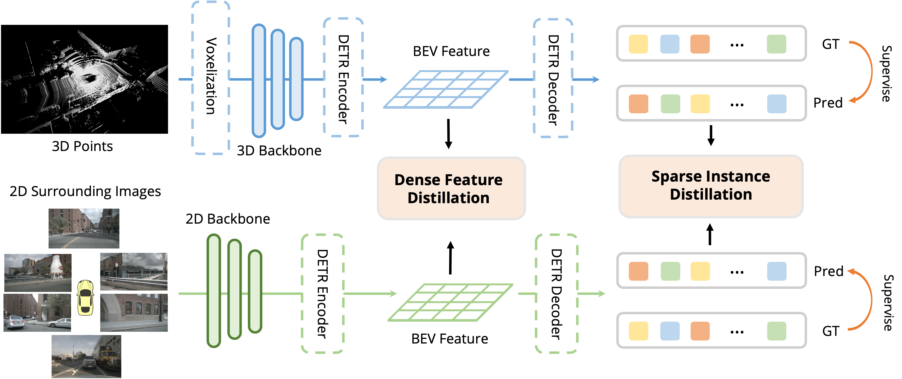

<div align="center">
<h1> BEVDistill </h1>
<h3>Cross-Modal BEV Distillation for Multi-View 3D Object Detection</h3>
<br>Zehui Chen, Zhenyu Li, Shiquan Zhang, Liangji Fang, Qinhong Jiang, Feng Zhao. 
<br>

<div><a href="https://arxiv.org/pdf/2211.09386.pdf">[Paper] </a></div> 

<center>

</center>

</div>

## NOTE

This code is an initial release with BEVFormer-T only, we will release a full version in the future.

## Run

```bash
# baseline
./tools/dist_train.sh projects/configs/video_bevformer/bevformer_128x128_r50_2x.py 8
# BEVDistill
./tools/dist_train_distill.sh projects/configs/bevdistill/bevdistill_r50_128x128_900query_bboxrweighttop100_bevgt_mocov2_merge_r1_2x.py 8
```

## Performance

### nuScenes Val set
| Model | config | mAP | NDS |
| - | - | - | - |
| BEVFormer-R50 | | 35.2 | 42.3 |
| BEVDistill-R50 | | 38.6 | 45.7 |
| BEVFormer-T-R50 | [link](./projects/configs/video_bevformer/bevformer_128x128_r50_2x.py) | 38.3 | 48.8 |
| BEVDistill-T-R50 | [link](./projects/configs/bevdistill/bevdistill_r50_128x128_900query_bboxrweighttop100_bevgt_mocov2_merge_r1_2x.py) | 40.7 | 51.5 |
| BEVFormer-T-R101 | [link](./projects/configs/bevformer_fp16/bevformer_128x128_r101_2x_fp16.py)| 40.5 | 50.6 |
| BEVDistill-T-R101 | [link](https://github.com/zehuichen123/BEVDistill/blob/main/projects/configs/bevdistill/bevdistill_r101_128x128_900query_bboxrweighttop100_bevgt_mocov2_merge_r1_2x.py) | 41.7 | 52.4 |

## Pretrain Checkpoints

|Model | Weight| mAP | NDS|
| - | - | -| -|
| ObjectDGCNN (Teacher)| [link](https://drive.google.com/file/d/1UX8Sc4A5aAnkPkdXoVEIV_sAlLlf9h_C/view?usp=sharing) | 67.4 | 61.5 |
| FCOS3D r50 (Student) | [link](https://drive.google.com/file/d/1iYQKrCKVCbJUMq56zn8of7dSPZd_CmnI/view?usp=sharing) | | |
